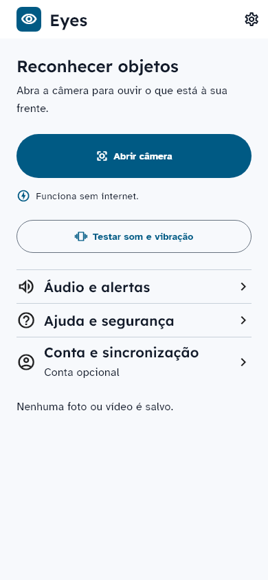
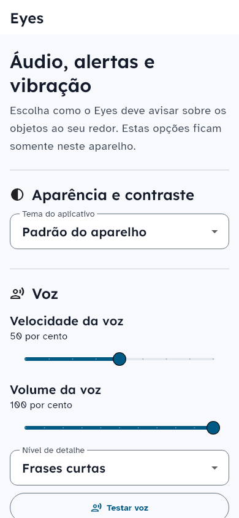

# Composição aprovada — Flutter (REN-60)

## Decisão e base

A direção v1 de REN-65 foi aprovada pelo responsável em 04/10/2026: “esta bem melhor . Boa vamos continuar avançando, seguindo com esse alto padrão de qualidade e desempenho”. [Contrato e proposta no Linear](https://linear.app/renatocesar/document/direcao-visual-eyes-proposta-webmobile-ren-65-04102026-5b1b254c7d5c).

Esta implementação usa o Flutter real, os componentes locais e os tokens canônicos. A prévia HTML é referência de composição; as capturas abaixo vêm de widgets Flutter com fontes locais reais e serviços substituídos nos testes.

Base `f6f2c363d3ce5269e38fa4a55f66485f89a92f59`: integração de calibração de REN-62, PR Mobile #17, ainda aguardando merge. O PR de composição inclui essa base para preservar opt-in, proteção de produção e identidade dos artefatos. A integração deve coordenar os dois PRs.

## Decisões implementadas

| Área | Composição | Contrato preservado |
| --- | --- | --- |
| Home | Marca compacta, título direto, câmera com altura mínima de 64 px; estado offline breve | Rota da câmera, navegação de ajuda/conta e conta opcional |
| Feedback | Teste de som/vibração antes da navegação secundária | Serviço existente, mensagem em live region e tratamento de falha |
| Configurações | Voz → alertas → vibração → aparência → privacidade; teste de voz no primeiro viewport com texto padrão | Persistência, TTS, háptico, fallback, avisos de erro e confirmação para restaurar |
| Texto ampliado | AppBar adapta altura ao texto; controles selecionados quebram linhas; slider exibe percentual compacto | Percentual completo anunciado por Semantics, ações de aumentar/diminuir e faixas existentes |
| Identidade | Quatro temas, Atkinson Hyperlegible/Lexend e ícones locais existentes | Alto contraste e seleção de tema, sem dependências novas |

A mensagem de privacidade permanece na Home; a conta continua explicitamente opcional. Nenhuma lógica de câmera, detecção, inferência, priorização, TTS, sincronização ou consentimento foi modificada. O scaffold mantém os valores anteriores por padrão; apenas estas duas telas ativam as opções de composição.

## Evidências e reprodução

`test/features/design/approved_composition_test.dart` cobre 48 combinações: duas telas × quatro temas × larguras 320/390 × texto 100%/150%/200%. Verifica ausência de erros de layout, alcance do conteúdo final, alvos Android de 48 px, nomes acessíveis e contraste de texto. Uma verificação adicional exercita câmera, configurações e feedback a partir da Home. O destino de câmera desse teste é um stub de rota; a suíte de varredura continua responsável pelo comportamento da câmera.

As oito capturas novas estão em `test/features/design/goldens/windows/`; as duas referências existentes de Home/configurações também foram atualizadas após aprovação da direção. A comparação de PNGs roda no Windows; os testes de comportamento, layout e Semantics rodam também na CI Linux. Referências de outros componentes foram preservadas.

Comandos: `flutter gen-l10n`, `dart format --output=none --set-exit-if-changed lib test tool`, `flutter analyze --no-pub`, `dart run tool/validate_design_tokens.dart`, `flutter test --no-pub --coverage`. Para reproduzir o APK de avaliação: `flutter build apk --profile --flavor dev --target lib/main_dev.dart`. O resultado final dos comandos, hashes e checks fica no PR e no checkpoint de REN-60.

## Limites e próximo ciclo

A aprovação da direção não equivale ao aceite em aparelho. TalkBack real, câmera, TTS Android, vibração, offline e uso prolongado dependem da avaliação física de REN-32. A nova composição não comprova melhorias de latência ou autonomia; não houve nova coleta física nem alteração do modelo/política de detecção. REN-67 aplica a direção ao onboarding, ajuda, conta e estados da varredura.
