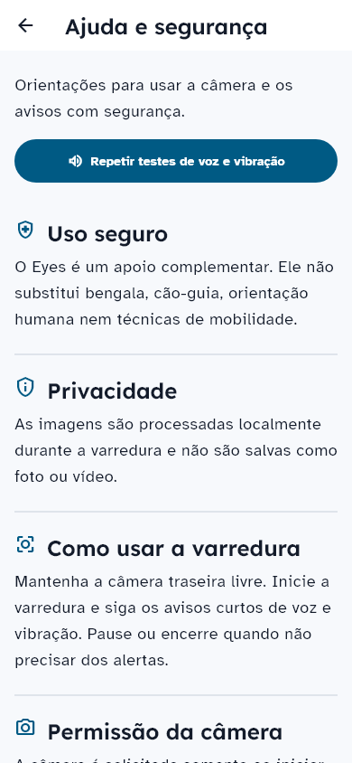
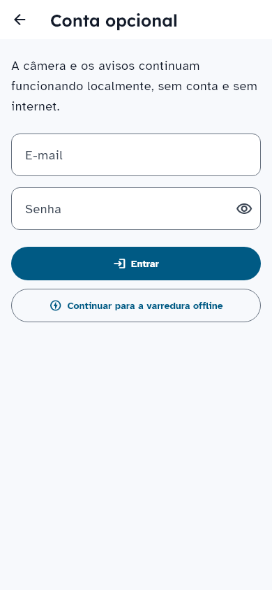
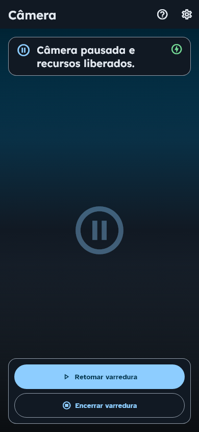
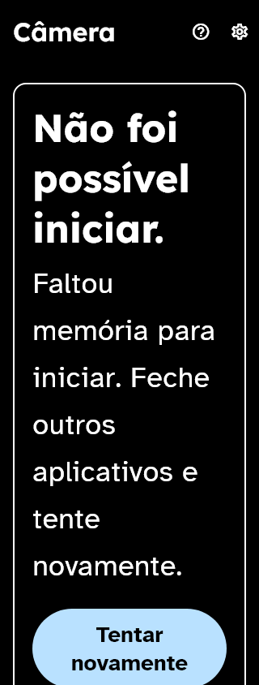

# Composição das telas auxiliares e da câmera — REN-67

## Base, escopo e decisão
Implementação iniciada em 04/10/2026 após o responsável informar que os MRs estavam integrados em `dev`. Base mobile: `5e8919f7ac0b2d1acbfe8a95f26aed96344512c0`. A direção de REN-65 e a composição de início/configurações de REN-60 já estavam aceitas; o frontend PR #21 foi integrado e conferido neste ciclo.

Este pacote aplica essa direção aos widgets Flutter reais de onboarding, ajuda, conta opcional e câmera. Não adiciona dependências, envio remoto, novo modelo, coleta de calibração nem alterações nas políticas de detecção. A sincronização real continua em REN-75; a validação física continua em REN-32.

## Comportamento implementado

| Destino | Resultado | Contrato preservado |
| --- | --- | --- |
| Onboarding | Progresso “Etapa N de 5”, hierarquia direta, sem ícone decorativo grande repetindo o título | Uma descrição semântica do progresso; permissão somente na ação contextual; privacidade, segurança, testes e replay |
| Ajuda | Teste de voz/vibração no primeiro viewport padrão; guias em linhas com divisores | Instruções de segurança, acesso ao replay, rotas e serviços existentes |
| Conta | “Conta opcional”, garantia de uso local e aviso explícito de envio ainda indisponível | Login opcional, confirmação de consentimento, revogação e fila existentes; nenhuma capacidade remota apresentada como concluída |
| Câmera | Título curto “Câmera”; painéis de estado opacos; texto de privacidade com tamanho legível | Preview prioritário, pausa, fim com confirmação, retomada, ciclo de vida, wake lock e prioridades existentes |
| Recuperação | Um painel para falha de reconhecimento, motivo sanitizado e ação; ícone decorativo removido em texto ampliado | Semantics, foco, live region e aviso háptico; sem exposição de detalhes internos nem nova fala duplicada |
| AppBar | Altura calculada pelas linhas reais e largura disponível, considerando botão de voltar e ações | Padrões anteriores preservados fora do modo adaptativo; títulos sem truncamento inclusive em texto 200% |

A Home passa a chamar o destino de “Conta opcional” uma única vez. As cinco referências de Home foram atualizadas por essa mudança deliberada. Configurações e seus controles permanecem na composição aprovada anteriormente.

## Evidência automatizada e limites
Verificação local final, Windows, Flutter 3.44.0:
- `dart format --output=none --set-exit-if-changed lib test tool`: 200 arquivos, zero alterações.
- `flutter analyze --no-pub`: nenhum apontamento.
- `dart run tool/validate_design_tokens.dart`: aprovado.
- `flutter test --no-pub --coverage`: **309 testes aprovados**.

A nova suíte contém 40 testes e verifica **320 combinações**: 312 de cinco etapas de onboarding, ajuda, conta visitante/conectada e cinco estados da câmera × quatro temas × larguras 320/390 × texto 100/150/200%; mais oito falhas de modelo (runtime/memória) em quatro temas, largura 320 e texto 200%. As animações estão desabilitadas nessa matriz.

Os testes verificam títulos completos e acionáveis, ausência de erro de layout, alvos Android de 48 px, nomes acessíveis, contraste de texto e alcance das ações por rolagem quando necessário. Ajuda e conta usam uma pilha real de Navigator para exercitar a largura ocupada pelo botão de voltar. Estados de câmera usam o coordenador real com gateways substituídos: pausa libera streaming/wake lock, falha deixa a sessão inativa e mantém recuperação alcançável.

A opacidade dos painéis é verificada por composição contra branco/preto. Isso comprova que seus textos não dependem do pixel de fundo; **não é uma captura física sobre cena clara/escura**. O fixture de câmera mostra uma superfície preta sem frames reais. TalkBack, TTS Android, háptico, lentes, permissões nativas e desempenho físico não foram executados neste pacote. Não se afirma melhora de latência, bateria ou precisão.

## Referências visuais e proveniência
Foram geradas e inspecionadas conscientemente **14 capturas novas** e **cinco de Home atualizadas**, em `test/features/design/goldens/windows/` e `test/features/home/goldens/windows/`. Onboarding cobre as cinco etapas; ajuda e conta cobrem destinos auxiliares; câmera cobre ativo, pausado, encerrado, permissão negada e erros de runtime/memória com texto 200%.

[Manifesto SHA-256](remaining-composition-baselines.json) relaciona cada PNG e os arquivos fonte usados na captura. O manifesto evita depender de um hash autorreferente do próprio commit; o SHA final do MR fica no registro de execução e no Linear. Os fontes Lexend, Atkinson Hyperlegible e Material Icons são os ativos locais reais dos testes. A revisão registrada é inspeção do assistente; aceite humano do pacote permanece pendente.

Comparações dessas novas referências rodam no Windows. Não foram produzidos PNGs nativos Linux; a matriz de comportamento/layout/Semantics roda na CI Linux. Referências históricas de outros componentes foram preservadas.






## Reprodução e revisão
Em um checkout limpo deste MR:
```text
flutter pub get
flutter gen-l10n
dart format --output=none --set-exit-if-changed lib test tool
flutter analyze --no-pub
dart run tool/validate_design_tokens.dart
flutter test --no-pub --coverage
flutter build apk --profile --flavor dev --target lib/main_dev.dart
```
Atualizar goldens exige comparar as capturas e revisar a mudança pretendida; executar `--update-goldens` isoladamente não constitui aprovação.

[Roteiro físico preparado para REN-32](remaining-composition-device-review.md). CI, hash final e identidade do APK de avaliação são registrados no MR/Linear depois de sua criação. A entrega fica em revisão, sem declarar o produto concluído ou o teste físico realizado.
